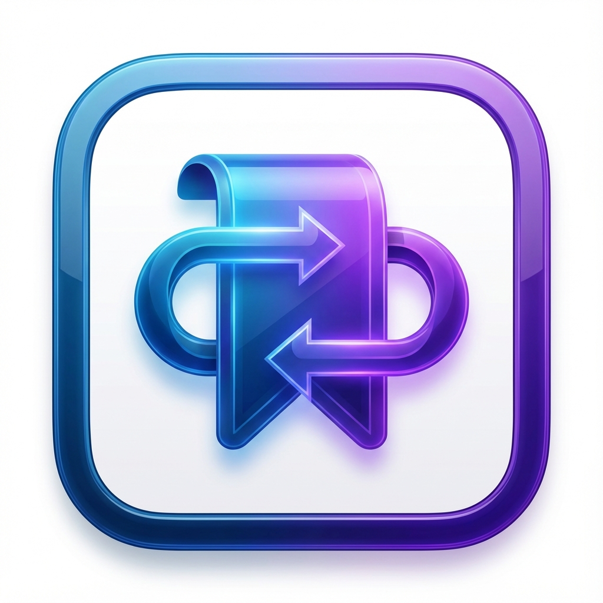

# Echo Bookmark Sync

<p align="center">
  
</p>

<p align="center">
  <strong>打破 Chrome 与 ChatGPT Atlas (macOS) 的数据壁垒，实现书签的无缝流动与智能同步。</strong>
</p>

<p align="center">
  <a href="#english">English</a> | <a href="#chinese">简体中文</a>
</p>

---

<a name="chinese"></a>
## ⚡ 项目概述

**Echo Bookmark Sync (回声书签同步)** 是一个从0实现的本地化书签同步工具，专为 macOS 用户设计。它旨在解决传统浏览器（Chrome）与新兴 AI 生产力工具（ChatGPT Atlas）之间的数据孤岛问题。

相比于其他同步工具，Echo 拥有 **🚀 四大核心优势**：

1.  **🔁 双向无感同步**
    不仅支持 Chrome 到 Atlas 的同步，也支持 Atlas 到 Chrome 的反向更新。无论您在哪里添加、修改或删除书签，另一端都会即时响应，如回声般自然。

2.  **🕵️‍♂️ 零配置智能检测**
    告别繁琐的路径配置。Echo 内置智能检测算法，启动即自动定位 Chrome 配置文件与 Atlas 数据存储位置，开箱即用。

3.  **📝 透明化回声日志**
    拒绝黑盒操作。所有同步行为（新增、删除、重命名）都会在日志中清晰呈现。独特的"变更检测"功能，能精准识别出 **同链接不同名** 的书签，让差异一目了然。

4.  **🔒 隐私与安全优先**
    遵循"数据不离地"原则。所有逻辑均在本地运行，绝不上传任何书签数据到云端服务器。内置时间戳冲突解决机制，最大程度防止数据意外覆盖。

## 🚀 快速开始

### 1. 安装应用
对于普通用户，无需配置环境，直接下载安装即可使用。

1.  前往 [Releases](https://github.com/gameziyi/echo-bookmark-sync/releases) 页面下载最新的 `.dmg` 安装包。
2.  双击 `.dmg` 文件，将 `Echo Bookmark Sync` 拖入 **Applications** 文件夹。
3.  在启动台（Launchpad）中点击图标运行。

### 2. 使用指南
*   **自动同步**：推荐模式。点击"启动自动同步"后，软件将后台监控文件变化，实时同步。
*   **手动同步**：适合单次整理。点击"手动同步一次"，软件会进行全量比对并合并差异。

## 🔧 源码启动指南

如果您是开发者，由于本项目完全开源，您可以从源码启动进行二次开发。

### 环境要求
*   Node.js >= 16.0.0
*   npm

### 启动步骤

1.  **克隆项目**
    ```bash
    git clone https://github.com/gameziyi/echo-bookmark-sync.git
    cd echo-bookmark-sync
    ```

2.  **安装依赖**
    ```bash
    npm install
    # 推荐使用 npm 或 yarn
    ```

3.  **启动开发模式**
    ```bash
    npm run dev
    ```

4.  **构建应用**
    ```bash
    npm run build-mac
    ```

## 🏗️ 技术栈列表

*   **Core**: Electron, Node.js
*   **File Watching**: Chokidar
*   **Build Tool**: Electron-Builder

## ⚠️ 免责声明

**重要提醒：本项目仅供学习、学术研究和个人提效使用**

1.  **合规性声明**：
    *   本项目完全免费、开源，仅用于辅助个人数据管理。
    *   严禁将本项目用于任何非法用途或侵犯第三方权益的行为。

2.  **数据安全免责**：
    *   尽管我们实现了冲突检测机制，但在极端情况下（如文件损坏、权限错误）仍可能存在数据风险。
    *   **建议定期备份您的 Chrome 书签**（书签管理器 -> 导出书签）。
    *   作者不对因使用本工具导致的任何直接或间接数据丢失承担责任。

3.  **技术免责**：
    *   本项目按"现状"提供，不提供任何明示或暗示的保证。
    *   使用者应自行评估项目的适用性和风险。

使用本项目即表示您已同意并接受上述所有条款。

## 📄 许可证

本项目采用 **MIT 许可证**。详细信息请参阅 LICENSE 文件。

---

<a name="english"></a>
## 🇬🇧 English

**Echo Bookmark Sync** is a local bookmark synchronization tool designed for macOS. It bridges the gap between traditional browsers (Chrome) and AI productivity tools (ChatGPT Atlas), putting an end to data silos.

### ⚡ Key Features

1.  **🔁 Bidirectional Seamless Sync**
    Changes reflect instantly in both directions. Add, edit, or delete a bookmark in one app, and the other responds like an echo.

2.  **🕵️‍♂️ Zero-Config Smart Detection**
    No complex setup required. Echo intelligently detects your Chrome and Atlas bookmark paths upon startup.

3.  **📝 Transparent Echo Logs**
    No black box operations. Every sync action (Add, Delete, Rename) is clearly logged. It even detects "Same URL, Different Name" conflicts.

4.  **🔒 Privacy First**
    "Data stays local." All processing happens on your machine. No bookmark data is ever sent to external servers.

### 🚀 Quick Start

1.  Download the latest `.dmg` from [Releases](https://github.com/gameziyi/echo-bookmark-sync/releases).
2.  Install to your **Applications** folder.
3.  Launch and click **"Start Auto Sync"**.

### 🔧 Build from Source

```bash
# Clone
git clone https://github.com/gameziyi/echo-bookmark-sync.git

# Install
npm install

# Dev
npm run dev

# Build
npm run build-mac
```

### ⚠️ Disclaimer

This tool is for personal and educational use only.
*   **Data Safety**: While safe, always backup your bookmarks before using sync tools.
*   **Liability**: The author is not responsible for any data loss or damages.
*   **Privacy**: This tool creates no network connections to send your data out.

**License**: MIT